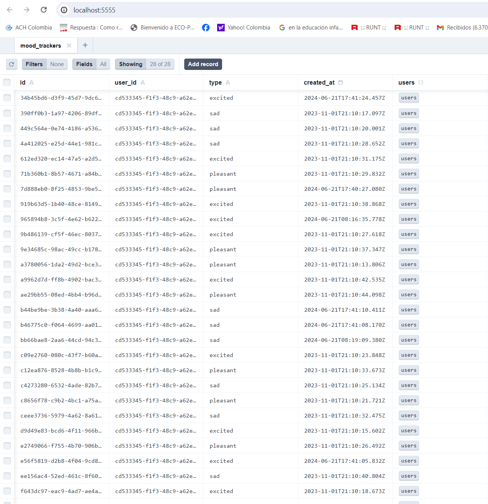

1. Clone the repository.
2. Create a copy of the `.env.template` and rename it to `.env`, then change the environment variables.
3. Install dependencies with `npm install`.
4. Run the command `npm run dev` to start the application in development mode.
5. Run these Prisma commands:
   ```
   npx prisma migrate dev
   npx prisma generate
   ```
6. Run the data seed to populate with example data:

   ```shell
   # users, products, product_images
   npm run seed
   ```

7. Run Prisma Studio to initially view the session tables at: http://localhost:5555/

   ```shell
   # It's a quick way to see the created records through the browser and also serves to edit or delete if necessary
   npx prisma studio
   ```
   
   <p align="center">
     <a href="#" target="blank"></a>
   </p>

8. Run the Prisma migrations with `npx prisma migrate dev`.
9. Run the project with `npm run dev`.

## Note: Default user for testing in development role: user
**username:** test3@google.com
**password:** Abc123

## Note: Default user for testing in development role: admin
**username:** test1@google.com
**password:** Abc123

## Run in production
```shell
npm run build
```

## Create a README.md file with instructions on how to run the app.

- Create [PRE_ASSIGNMENT_ANSWERS.md](./PRE_ASSIGNMENT_ANSWERS.md) and [POST_ASSIGNMENT_ANSWERS.md](./POST_ASSIGNMENT_ANSWERS.md) files in the repo to answer the pre and post assignment questions.

- Create a Dockerfile and any other necessary files to build and run your API and the UI in a Docker container.
